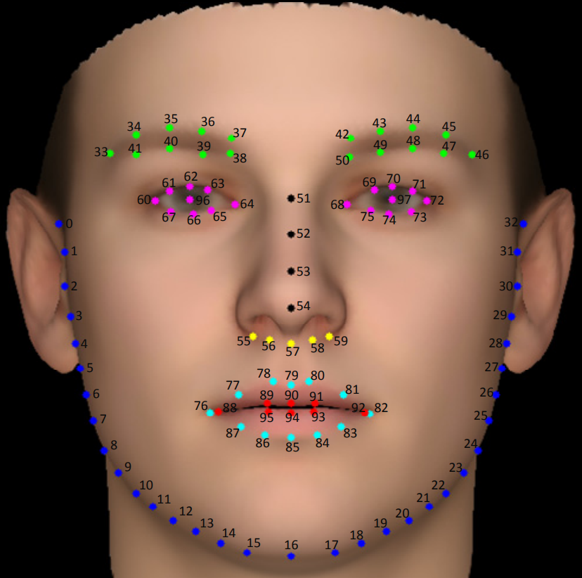

# 脸部关键点识别

### 项目描述

​	练手项目,基于Tensorflow脸部98关键点识别,可以识别出脸部的98个关键点,是人脸识别,表情识别,人脸密码等诸多功能的底层实现

### 使用
#### 使用前请确保具有NVIDIA GPU 和 Tensorflow环境
`pip install tensorflow-gpu==2.5.0`
`pip install opencv`

### 运行
`python inference.py`

### 训练
`python train.py --epocho=300 --train_path=/data/xxx`

#### 本项目使用数据

链接：https://pan.baidu.com/s/1MVxN0x3hWuzBcLWdeR4u-Q 
提取码：csn9 

### 效果展示

### 联系

* 有关本项目的任何问题，欢迎讨论；
* 后续更多开源项目，请持续关注；
* 